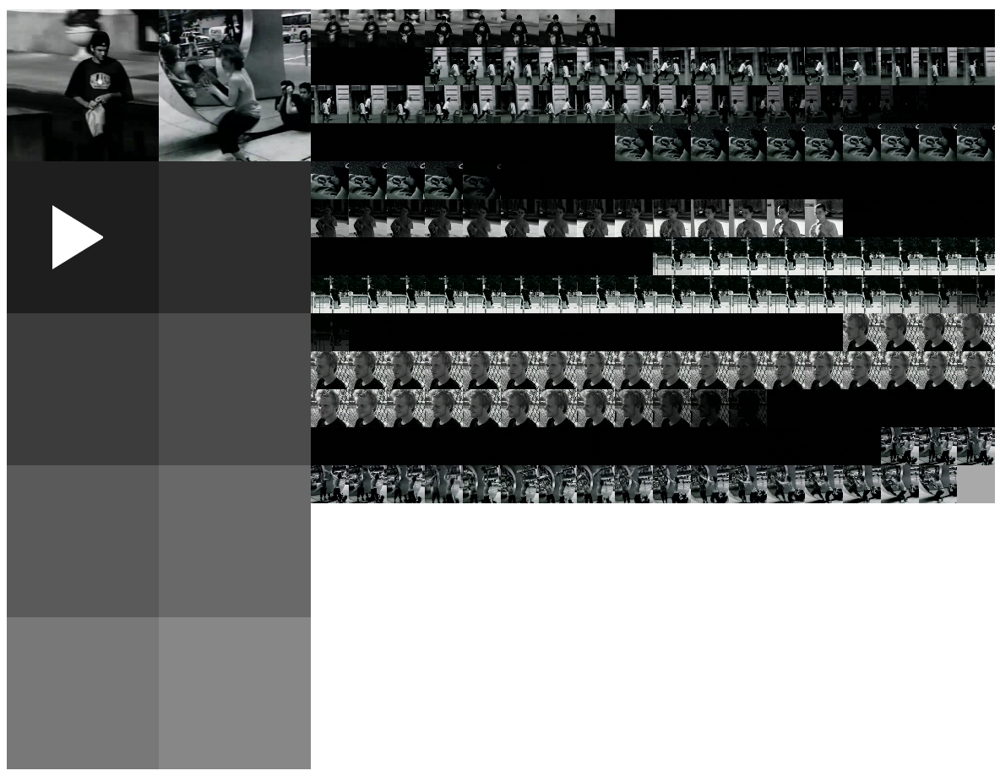

<p align="center">
  
</p>


# Video-printer :printer: :tv:
> All art is quite useless. | *Oscar Wilde, The Picture of Dorian Gray*

- :page_facing_up: Print video frames on screen
- :star2: Only standard JS/HTML/CSS
- :100: 100% dependencies free
- :skull: Obviously useless (as it is)

## Getting started
1. Clone this repo
2. cd to the root directory
3. Launch a local web server, for example:


    - If you have a Python Interpreter installed: ```python -m SimpleHTTPServer 8000```
    - If you use Visual studio Code, get the [live server extension](https://marketplace.visualstudio.com/items?itemName=ritwickdey.LiveServer)
    - ... Or just open the index.html in a browser :fox_face:

## Demo
https://sebbmn.github.io/video-printer/

## License
MIT

## Credits
:alien: [Alien Workshop's](https://en.wikipedia.org/wiki/Alien_Workshop) Photosynthesis [video](https://archive.org/details/photosynthesis_201911) is used as a nostalgic example for the demo
